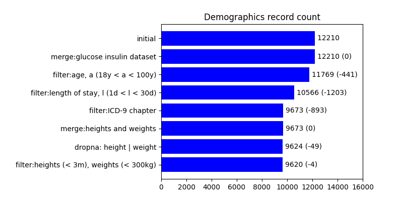

## Curating demographics

The demographics dataframe is constructed
by [`generate_df_demographics(engine, df_glucose_insulin, df_icu_stays, df_admissions, df_patients, df_diagnoses_icd, subject_ids, chunk_size)`](../curation/demographics/generate_df_demographics.py).

The tables `icustays`, `admissions`, and `patients` are merged to form the demographics dataframe.

### Calculating age

The age is calculated by [`calculate_age(df)`](../curation/demographics/calculate_age.py), which calculates the age of
the patient
from
the date of birth and the timestamp of admission
using the library `dateutil`'s `relativedelta` function, and accessing its `years` property.

The demographics dataframe which is constructed from queries from the MIMIC-III database is then merged with the glucose
insulin dataset using an `inner` merge, which means only the records with an ICU stay identifier in both datasets are
preserved.

The dataset is filtered by age and length of stay, using the bounds set
in [`Filter`](../curation/demographics/filter.py).

Only relevant columns are kept from the demographics dataframe.

### Removing individuals with neoplasms or pregnant individuals

The hospital admission identifiers in the `diagnoses_icd` table with ICD-9 codes that satisfy the constraints below are
removed from the demographics dataframe:

- null;
- in the range 140–239 representing the ICD-9 chapter _neoplasms_; or
- in the rage 630–679 representing the ICD-9 chapter _complications of pregnancy, childbirth, and the puerperium_

### Adding heights and weights

#### Generating the SQL query

Heights and weights are queried from the `chartevents` table. The query is generated
by [`generate_heights_weights_query.py`](../curation/demographics/generate_heights_weights_query.py) and handles:

- Conversion to the metres and kilograms for height and weight respectively;
- Casting to a numeric type;
- Rounding to 2 decimal places;
- Filtering by subject identifier, item identifier, non-null ICU stay identifiers, numeric values, and non-zero
  numerical values; and
- Ordering by subject identifier, ICU stay identifier, and the chart time.

The process of selected salient items for height and weight is discussed
in [_Calculating weights and heights_](calculating-weights-and-heights.md).

#### Post-processing of the SQL query

[`query_heights_weights.py`](../curation/demographics/query_heights_weights.py) carries out the SQL query. The chart
time column in
the
dataframe is converted to a `datetime` object. The dataframe is grouped by ICU stay identifier and then forward- and
back-filled to fill in null values.

At this point, there may be >1 record for each subject identifier for each ICU stay identifier. To mitigate this, the
dataframe is grouped by ICU stay identifier, and then to select the most recent record, the last record in the group is
taken, as the dataframe is ordered by chart time.

The heights and weights dataframe is merged with the demographics dataframe using an `left` merge, meaning that the
records in the demographics dataframe are preserved, and height and weight data is added only if the matching ICU stay
identifier and subject identifier are found in the heights and weights dataframe.

The records with no height or weight data are dropped from the df_demographics table.

### Record count

Below is a plot of the count of the records in the demographics dataframe after each operation:

