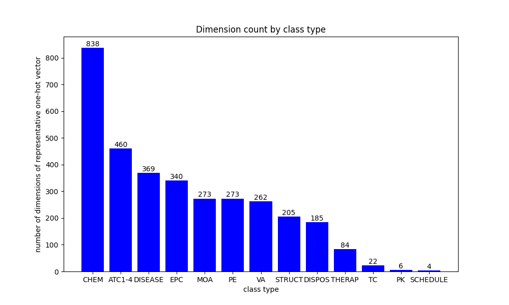
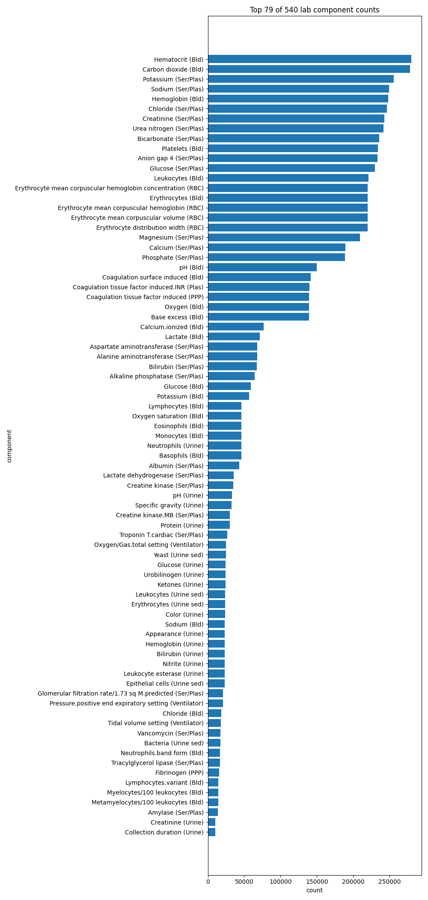

## Selecting features

## Static features

From static demographics dataframe, excluding identifiers the following features are selected:

- age
- gender
- weight
- height

The gender column is mapped to binary values representing sex.

### Dynamic features

#### Prescriptions

From the prescription classification results, we can extract the therapeutic classification (i.e., the ATC code) from
each prescription record. However, from the dimension count by class type plot we can see that the number of dimensions
for the ATC1-4 classification system is 460, which will ultimately represent one column in our final dataset.



To reduce the 'resolution' of our classification, as the ATC code can be taken at different levels, we can crudely
represent each prescription as the first ATC level.

```python
level_1_dict = {
    "A": "ALIMENTARY TRACT AND METABOLISM",
    "B": "BLOOD AND BLOOD FORMING ORGANS",
    "C": "CARDIOVASCULAR SYSTEM",
    "D": "DERMATOLOGICALS",
    "G": "GENITO URINARY SYSTEM AND SEX HORMONES",
    "H": "SYSTEMIC HORMONAL PREPARATIONS, EXCL. SEX HORMONES AND INSULINS",
    "J": "ANTIINFECTIVES FOR SYSTEMIC USE",
    "L": "ANTINEOPLASTIC AND IMMUNOMODULATING AGENTS",
    "M": "MUSCULO-SKELETAL SYSTEM",
    "N": "NERVOUS SYSTEM",
    "P": "ANTIPARASITIC PRODUCTS, INSECTICIDES AND REPELLENTS",
    "R": "RESPIRATORY SYSTEM",
    "S": "SENSORY ORGANS",
    "V": "VARIOUS",
}
```

Each of the level 1 groups will become a column in our dynamic dataset:

- `1` will represent a prescription with that
  classification,
- `0` for a prescription without that classification, and
- `-1` for a missing value.

### Lab events

You can find the unique components of the lab events, their count, and the count per subject
id [here](lab-components.md).

There are 345 different components, and we must select salient features that are not sparsely reference in the
prescriptions table. We can set a threshold of 1 count per subject id to select components. This leaves us with the 69
top components from the table.



From these the following will be selected:

- 