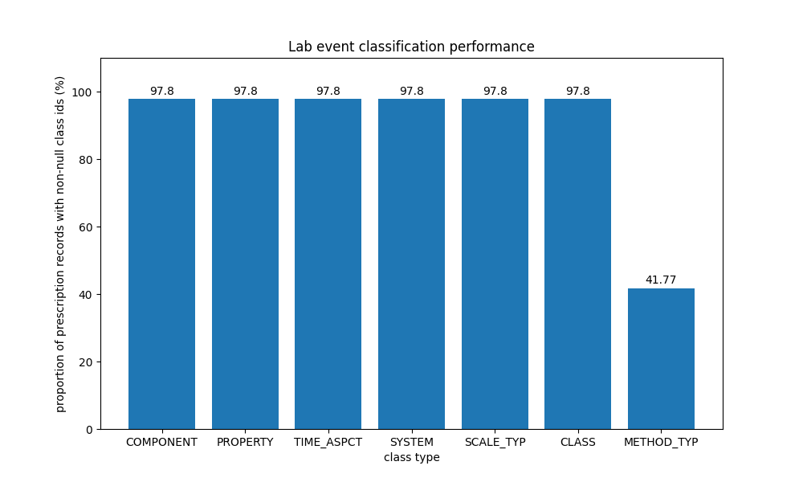
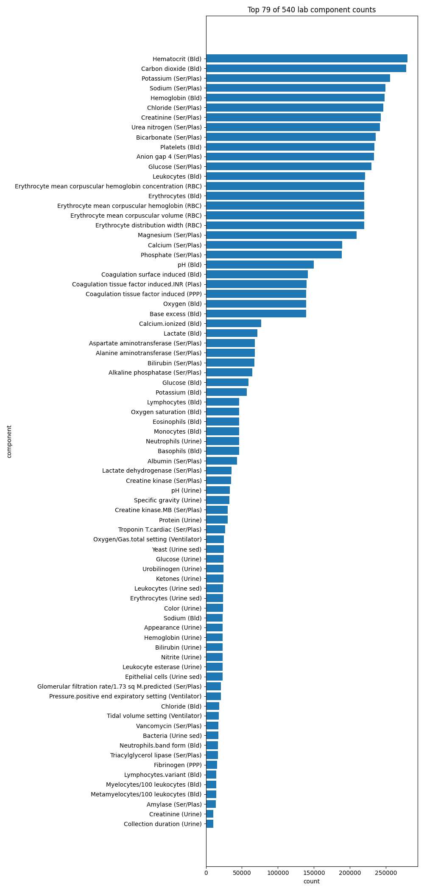

## Classifying lab events using LOINC

### Querying MIMIC-III

The lab events are queried from the MIMIC-III Clinical Dataset, chunked by sets of subject identifiers to monitor query
progress. The dictionary of item identifiers are also queried fro mthe MIMIC-III Clinical Dataset, without chunking due
to the
small query size.

### Reading the LOINC database

The LOINC database is read from a `.csv` file, and loaded into a dataframe.

### Classifying lab events

Using a dataframe merge on the LOINC codes, the extra metadata from the LOINC database is added to the lab item
dictionary. Another merge with the lab events dataframe is performed to add the LOINC metadata to the lab events.

### Classification performance

The classification performance of the LOINC codes is summarised below. Each bar represents one of the 'classes' of
metadata provided by a LOINC code. You can read more about the parts of a LOINC code on
their [website](https://loinc.org/get-started/loinc-term-basics/).

The classification performance of all non-optional LOINC code parts is 97.8%.

### Component counts

The top 30 values for the most salient part, the component, is plotted below.

