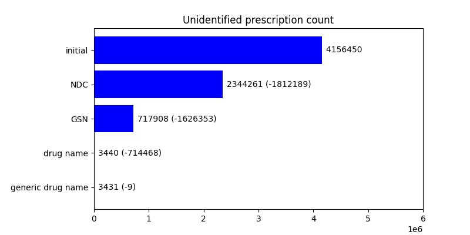

## Classifying prescriptions using RxNorm and RxClass

The prescription table is transformed into one-hot vectors for training. There is insufficient overlap of drug labelling
at the sample size of the MIMIC-III dataset. Therefore, the drugs in the prescription table are classified into broad
categories to reduce the dimensions of their representative one-hot vectors.

### Necessary APIs

The APIs used for this processing include:

- The [RxNorm]() API is used to identify the drugs in each prescription record.
- The [RxClass]() API is used to find their classification according to various classification systems.

These APIs are available through the [RxNav-in-a-Box](https://lhncbc.nlm.nih.gov/RxNav/applications/RxNav-in-a-Box.html)
distribution.

The RxNav-in-a-Box **must** be used locally due to the number of requests involved in the processing of prescription
data. There is a hard-limit of 20 requests per second, per IP address stated on the RxNorm
API [Terms of Service](https://lhncbc.nlm.nih.gov/RxNav/TermsofService.html). The processing steps outlined below can
reach ~200 GET requests a second.

### Identifying drugs

In the prescriptions table, the following columns are capable of identifiying the drug:

- `drug`
- `drug_name_poe`
- `drug_name_generic`
- `formulary_drug_cd`
- `gsn`
- `ndc`

The reference for the prescription table's column keys can be found on the
MIMIC-III [documentation](https://mimic.mit.edu/docs/iii/tables/prescriptions/).

Identifying drugs involves finding the RxCUI (Concept Unique Identifier) for each prescription record using the data
provided in these columns of the prescriptions table.

#### National Drug Code (NDC)

The `ndc` column represents the National Drug Code, a unique identifier for human drugs in the United States, catalogued
by the US Food and Drug Administration in
the [NDC Directory](https://www.fda.gov/drugs/drug-approvals-and-databases/national-drug-code-directory).

Not all prescription records have an `ndc` code. Some key proportions include:

- Out of 4156450 records, 586586 records are without an NDC code, which is 14.1% (to 3 significant figures) of the total
  number of records.
- Out of 52151, 48649 ICU stay identifiers are without an NDC code, which affects 93.3% (to 3
  significant figures) of the ICU stays.

Despite the low rate of missing NDC codes, the high proportion of ICU stays affected by this issue requires an
alternative, fallback strategy.

The RxCUI can be found from an NDC code using
the [`findRxcuiById(format:idtype:id:allsrc:)`](https://lhncbc.nlm.nih.gov/RxNav/APIs/api-RxNorm.findRxcuiById.html)
endpoint. The endpoint is accessed in the
function [`find_rxcui_by_id`](./../curation/prescriptions/find_rxcui_by_id/find_rxcui_by_id.py).

#### Generic Sequence Number (GSN)

The `gsn` column represents the Generic Sequence Number (GSN), a unique identifier issued by First Databank. The GSN
code can be used as a fallback for those records that do not have an effective NDC (i.e., one that does not yield a
RxCUI).

The RxCUI can be found from a GSN code using the same endpoint and python implementation as
the [National Drug Code (NDC)](#national-drug-code-ndc).

#### Drug name and generic drug name

For the ineffective NDC and GSN codes (i.e., those that do not yield an RxCUI), the drug name can be used to find the
best approximate match using
the [`getApproximateMatch(format:term:maxEntires:option:)`](https://lhncbc.nlm.nih.gov/RxNav/APIs/api-RxNorm.getApproximateMatch.html)
endpoint. The endpoint is accessed in
the [`get_approximate_match`](./../curation/prescriptions/get_approximate_match/get_approximate_match.py) function. The
candidates are sorted by their score, and the top score is chosen.

If the drug name does not yield an RxCUI, the _generic_ drug name is used.

### Unidentified prescription count

The number of prescription records with unidentified drugs (i.e., those without an RxCUI) after each lookup is outlined
in the plot below.

Through the hierarchy of lookups using the NDCs, GSNs, drug names, and generic drug names, the number of unidentified
prescription records falls.

> **Note**: We must appreciate and assume that the drugs have been truthfully entered into the dataset, and that the
> RxCUIs are appropriately selected for each prescription.

## Classifying drugs

Classification of the drug associated with each prescription is carried out by the RxClass API. Each prescription
record, after the [drug identification](#identifying-drugs) process, has an RxCUI associated with it. The RxCUI, in
conjunction with
the [`getClassByRxNormDrugId(format:rxcui:relaSource:relas:)`](https://lhncbc.nlm.nih.gov/RxNav/APIs/api-RxClass.getClassByRxNormDrugId.html)
endpoint, accessed in python by the function
[`get_class_by_rxcui`](./../curation/prescriptions/get_class_by_rxcui/get_class_by_rxcui.py).

The classification results are added to the prescription dataframe. For each class type, the class name and the class id
are included. The class id is used to create the one-hot vectors for training.

### Classification performance

The proportion of prescription records with non-null class ids for each class type are plotted below.

We can see that the `CHEM` and `ATC1-4` class types are the most performant (i.e., classify the most records in the
prescription table).