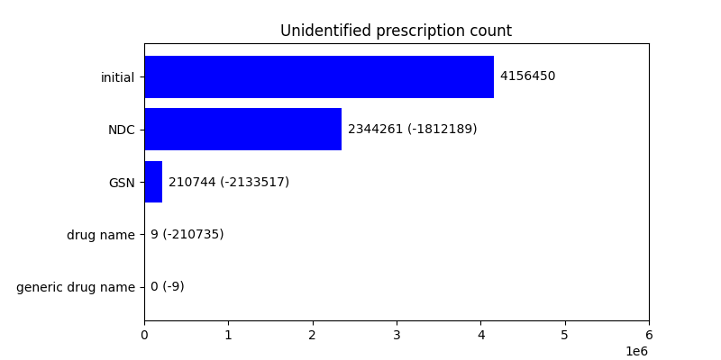
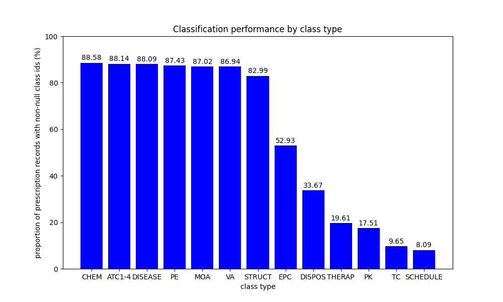
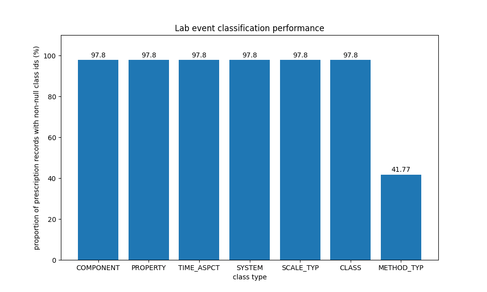

# Reinforcement learning-based glucose management in the intensive care unit: technical overview

Tahmid Azam, January 2025

## Introduction

The base dataset is a set of glucose readings and insulin entries (referred to
as the 'glucose dataset'), based on the MIMIC-III Clinical Dataset. Curation
involves integrating the additional patient data provided by MIMIC-III, and
augmenting this data using pre-established classification systems. Additional
patient data involves age, height, weight, prescription data, and biochemical
test data. Prescription data is classified and organised using the RxNorm and
RxClass application programming interfaces (APIs) provided by the National
Institutes of Health (NIH).

## Demographcs data

The term 'demographics' represents age, weight, and height data. The
demographics dataframe is formed from merging `icustays`, `admissions`, and
`patients` tables from MIMIC-III. These tables are then merged with the glucose
dataset using an `inner` merge to preserve records that have an ICU stay
identifier in _both_ datasets.

### Age

The age is calculated by
[`calculate_age(df)`](../curation/demographics/calculate_age.py), which
calculates the age of the patient from the date of birth and the timestamp of
admission using the library `dateutil`'s `relativedelta` function, and accessing
its `years` property.

### Calculating heights and weights

Weight and height information is taken from measurements carried out during the
ICU stay, organised into labelled records in the `d_items` MIMIC-III table.

Using the item identifiers that containing 'weight' in their label were queried
and the following items were selected to represent weight data for each subject.

| itemid | label                   |
| ------ | ----------------------- |
| 580    | Previous Weight         |
| 581    | Previous WeightF        |
| 763    | Daily Weight            |
| 224639 | Daily Weight            |
| 226512 | Admission Weight (Kg)   |
| 226531 | Admission Weight (lbs.) |
| 226846 | Feeding Weight          |

Using the item identifiers that containing 'height' in their label were
similarly queried and the following items were selected to represent height data
for each subject.

| itemid | label         | Conversion factor to metres |
| ------ | ------------- | --------------------------- |
| 1394   | Height Inches | 0.0254                      |
| 226707 | Height        | 0.0254                      |
| 226730 | Height (cm)   | 0.01                        |

As there may be more than 1 record for each subject identifier and ICU stay
identifier, the dataset dataframe is grouped by the ICU stay identifer and the
most recent record is taken. Height and weight data is merged using a `left`
merge, meaning that all the records are preserved and height and weight data is
included if present, and left null if not.

### Inclusion criteria

Subjects must:

- not have an International Classification of Diseases, 9th Revision (ICD-9)
  code that is `null`, in the range 140–239 (representing the _neoplasm_
  chapter), or in the range 630–679 (representing the _complications of
  pregnancy, childbirth, and the puerperium_ chapter);
- have a non-`null` age, $a$, that satisfies $18 < a > 100$;
- have a non-`null` weight in kilograms, $w$, that satisfies $w < 300$;
- have a non-`null` height in metres, $h$, that satisfies $h < 3$; and
- have an ICU stay that does not exceed 30 days.

## Prescriptions data

In order to augment the prescription data, we first _identify_ each
prescription, and then _classify_ each prescription with each established
classification system.

The APIs used for this processing include:

- The [RxNorm]() API is used to identify the drugs in each prescription record.
- The [RxClass]() API is used to find their classification according to various
  classification systems.

These APIs are available through the
[RxNav-in-a-Box](https://lhncbc.nlm.nih.gov/RxNav/applications/RxNav-in-a-Box.html)
distribution.

### Identification of drugs

Identifying drugs involves finding the RxCUI (Concept Unique Identifier) for
each prescription record using the prescription data provided.

In the prescriptions table, the following columns are capable of identifiying
the drug:

- `drug`
- `drug_name_poe`
- `drug_name_generic`
- `formulary_drug_cd`
- `gsn`
- `ndc`

These form a hierarchy of information, where if the RxCUI cannot be found at one
level, the next level is used, until an identifier is found or the columns run
out:

#### 1. National drug code (NDC)

The `ndc` column represents the National Drug Code, a unique identifier for
human drugs in the United States, catalogued by the US Food and Drug
Administration in the
[NDC Directory](https://www.fda.gov/drugs/drug-approvals-and-databases/national-drug-code-directory).

Not all prescription records have an `ndc` code. Some key proportions include:

- Out of 4156450 records, 586586 records are without an NDC code, which is 14.1%
  (to 3 significant figures) of the total number of records.
- Out of 52151, 48649 ICU stay identifiers are without an NDC code, which
  affects 93.3% (to 3 significant figures) of the ICU stays.

Despite the low rate of missing NDC codes, the high proportion of ICU stays
affected by this issue requires an alternative, fallback strategy.

The RxCUI can be found from an NDC code using the
[`findRxcuiById(format:idtype:id:allsrc:)`](https://lhncbc.nlm.nih.gov/RxNav/APIs/api-RxNorm.findRxcuiById.html)
endpoint. The endpoint is accessed in the function
[`find_rxcui_by_id`](./../curation/prescriptions/find_rxcui_by_id/find_rxcui_by_id.py).

#### 2. Generic Sequence Number (GSN)

The `gsn` column represents the Generic Sequence Number (GSN), a unique
identifier issued by First Databank. The GSN code can be used as a fallback for
those records that do not have an effective NDC (i.e., one that does not yield a
RxCUI).

The RxCUI can be found from a GSN code using the same endpoint and python
implementation as the [National Drug Code (NDC)](#national-drug-code-ndc).

#### 3. Drug name and generic drug name

For the ineffective NDC and GSN codes (i.e., those that do not yield an RxCUI),
the drug name can be used to find the best approximate match using the
[`getApproximateMatch(format:term:maxEntires:option:)`](https://lhncbc.nlm.nih.gov/RxNav/APIs/api-RxNorm.getApproximateMatch.html)
endpoint. The endpoint is accessed in the
[`get_approximate_match`](./../curation/prescriptions/get_approximate_match/get_approximate_match.py)
function. The candidates are sorted by their score, and the top score is chosen.

If the drug name does not yield an RxCUI, the _generic_ drug name is used.

#### Assessing identification performance

The number of prescription records with unidentified drugs (i.e., those without
an RxCUI) after each lookup is outlined in the plot below.

Through the hierarchy of lookups using the NDCs, GSNs, drug names, and generic
drug names, the number of unidentified prescription records falls.

### Classification of drugs

Classification of the drug associated with each prescription is carried out by
the RxClass API. Each prescription record, after the
[drug identification](#identifying-drugs) process, has an RxCUI associated with
it. The RxCUI, in conjunction with the
[`getClassByRxNormDrugId(format:rxcui:relaSource:relas:)`](https://lhncbc.nlm.nih.gov/RxNav/APIs/api-RxClass.getClassByRxNormDrugId.html)
endpoint, accessed in python by the function
[`get_class_by_rxcui`](./../curation/prescriptions/get_class_by_rxcui/get_class_by_rxcui.py).

The classification results are added to the prescription dataframe. For each
class type, the class name and the class id are included. The class id is used
to create the one-hot vectors for training.

### Classification performance

The proportion of prescription records with non-null class ids for each class
type are plotted below.

We can see that the `CHEM` and `ATC1-4` class types are the most performant
(i.e., classify the most records in the prescription table).

## Biochemical test data

A flaw of the MIMIC-III dataset is that labelling of biochemical test data
varies (i.e., a serum potassium concentration is labelled in multiple different
ways). Using the Logical Observation Identifiers Names and Codes (LOINC) system,
we can ensure a consistent reporting of each biochemical test.

### Method of labelling

The lab events are queried from the MIMIC-III Clinical Dataset, chunked by sets
of subject identifiers to monitor query progress. The dictionary of item
identifiers are also queried from the MIMIC-III Clinical Dataset, without
chunking due to the small query size. The LOINC database is read from a `.csv`
file, and loaded into a dataframe. Using a dataframe merge on the LOINC codes,
the extra metadata from the LOINC database is added to the lab item dictionary.
Another merge with the lab events dataframe is performed to add the LOINC
metadata to the lab events.

### Classification performance

The classification performance of the LOINC codes is summarised below. Each bar
represents one of the 'classes' of metadata provided by a LOINC code. You can
read more about the parts of a LOINC code on their
[website](https://loinc.org/get-started/loinc-term-basics/).

The classification performance of all non-optional LOINC code parts is 97.8%.

### Top biochemical tests

The top 79 values for the most salient part, the component, is plotted below.

## Dataset transformations

The final dataset first combines the glucose dataset, demographics,
prescription, and biochemical test data.

Records are grouped by subject identifier, admission identifier, and ICU stay
identifier, and then processed group by group. Biochemical tests are aggregated
by LOINC codes, and Anatomical Therapeutic Chemical (ATC) codes to level 2 are
derived from prescription data. These are assembled into columns for each of
their classes. The group is finally resampled by the specified time delta, with
a default of 2 hours. Columns containing only null values are dropped.
